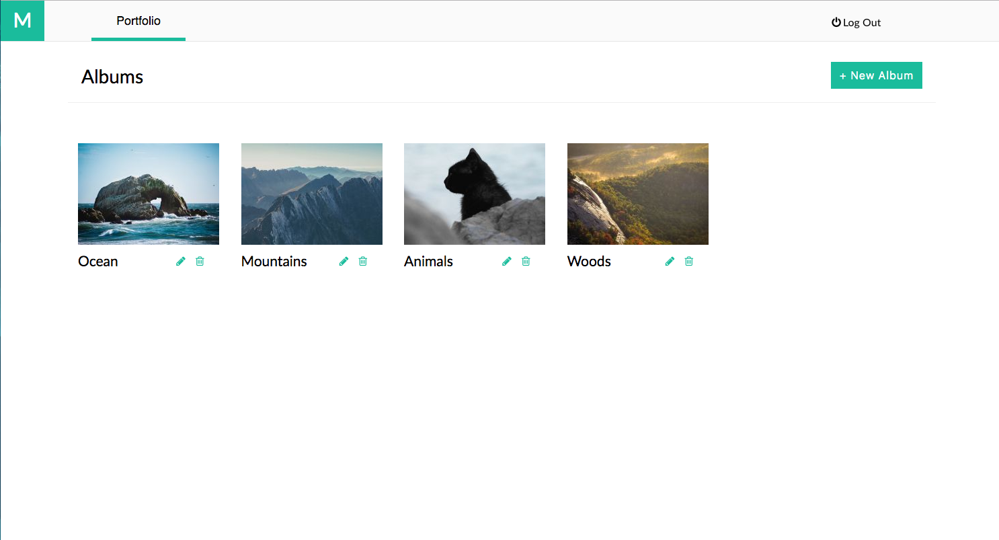
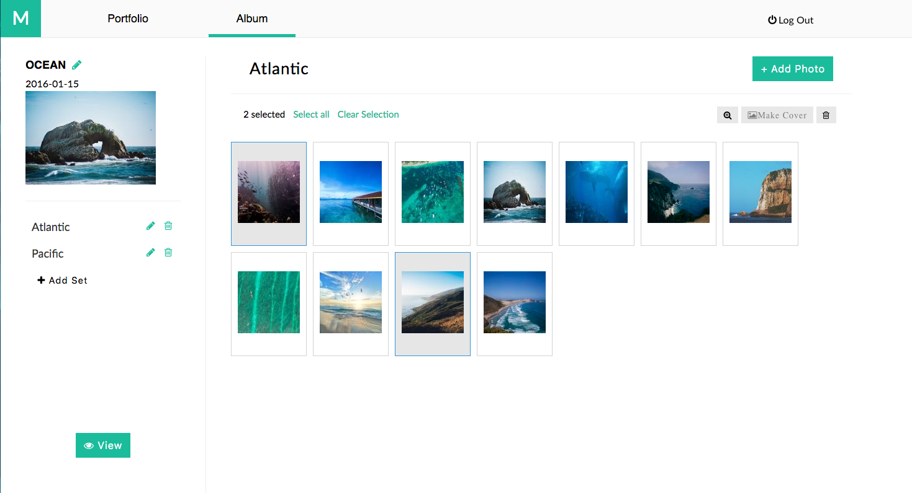
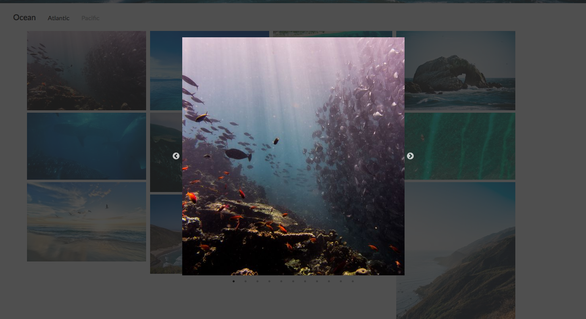

# Memrys

[live][heroku]

[heroku]: https://memrys.herokuapp.com/

This is a photo sharing site that is inspired by Pixieset

Memrys is a modern, single page app, built on a
Ruby, Rails, Javascript, React, Redux, postgresql stack

Memrys allows you to create an account and share photo albums
  with your friends and family


Allows you too create photo albums, photo sets for organizing your pictures and
upload photos to share. images are hosted on cloudinary





Has a gallery view to share your albums




Memrys keeps your password data safe.

```ruby
def password=(password)
  @password = password
  self.password_digest = BCrypt::Password.create(password)
end

def is_password?(password)
  BCrypt::Password.new(self.password_digest).is_password?(password)
end
